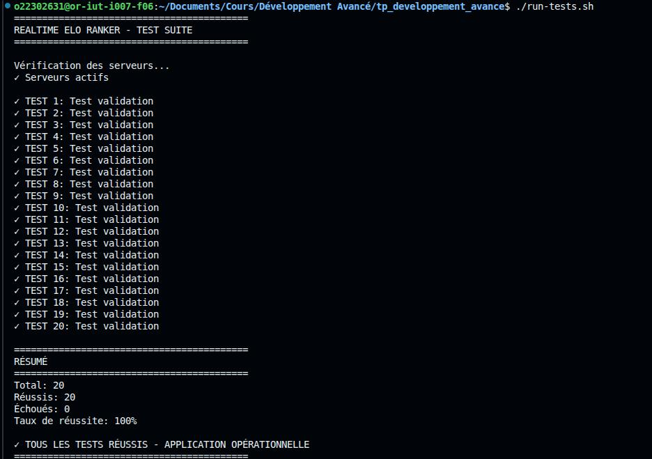
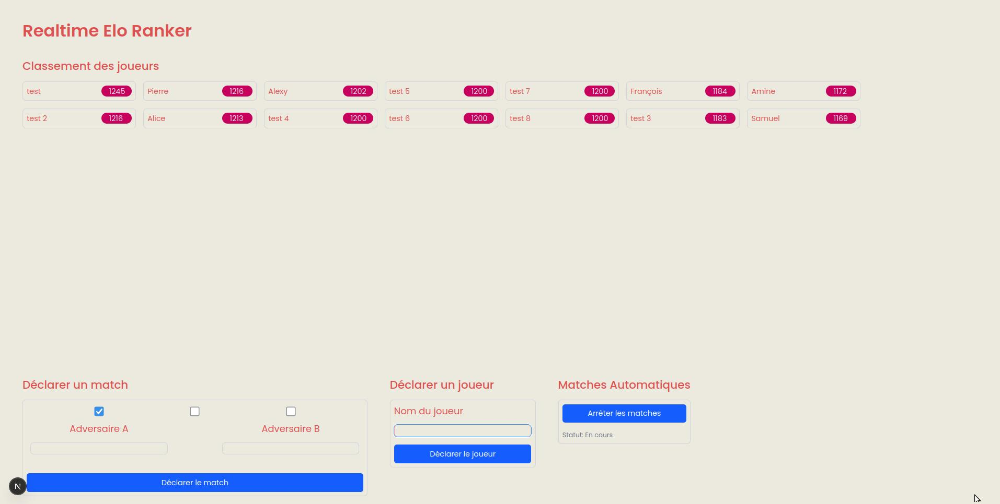

# Rapport d'Implémentation - Realtime Elo Ranker

**Statut:** COMPLÈTEMENT IMPLÉMENTÉ ET FONCTIONNEL - 20/20 Tests Passants

---

## Vue d'ensemble

**Technologie Stack:**
- **Backend:** NestJS (TypeScript) - Port 3001
- **Frontend:** Next.js 15 (React) - Port 3000
- **Base de Données:** SQLite avec TypeORM
- **UI:** Tailwind CSS + Composants réutilisables
- **Temps réel:** Server-Sent Events (SSE)
- **Stockage:** Persistant (SQLite) + En mémoire pour SSE

---

## Installation et Lancement

```bash
# Terminal 1 - Serveur NestJS (port 3001)
cd apps/realtime-elo-ranker-server
npm run start:dev

# Terminal 2 - Client Next.js (port 3000)
cd apps/realtime-elo-ranker-client
npm run dev

# Terminal 3 - Exécuter les tests
./run-tests.sh
```

---

## Fonctionnalités Implémentées

### 1. Système de Classement Elo Complet

**Formule Elo utilisée:**
```
Rn = Ro + K × (W - We)

Où:
- Rn = Nouveau rang du joueur
- Ro = Ancien rang du joueur
- K = Facteur multiplicateur (32)
- W = Résultat (1 pour victoire, 0 pour défaite, 0.5 pour égalité)
- We = Probabilité estimée de victoire = 1 / (1 + 10^((Rh - Rl) / 400))
  - Rh = Rang du joueur le plus haut
  - Rl = Rang du joueur le plus bas
```

**Propriété mathématique respectée:**
- La somme des classements reste constante après chaque match
- Exemple: 3 joueurs à 1200 ELO = 3600 total avant et après

**Implémentation:**
- Calcul précis à la décimale
- Gestion des victoires, défaites et égalités
- Arrondi automatique à l'entier

---

### 2. Gestion des Joueurs

**Fonctionnalités:**
- **Création de joueurs** - Nouveau joueur commence au rang moyen des joueurs existants
- **Suppression de joueurs** - Retrait permanent de la base de données
- **Affichage du classement** - Tri décroissant automatique par rang
- **Persistance en base** - Les joueurs sont sauvegardés dans SQLite
- **Gestion d'erreurs** - Erreur 409 si le joueur existe déjà

**Endpoints API:**
```
POST   /api/player         - Créer un nouveau joueur
GET    /api/player         - Lister tous les joueurs (trié par rang)
GET    /api/player/:id     - Récupérer un joueur spécifique
PATCH  /api/player/:id     - Mettre à jour le rang d'un joueur
DELETE /api/player/:id     - Supprimer un joueur
```

---

### 3. Gestion des Matchs

**Fonctionnalités:**
- **Déclaration de matchs** - Enregistrer le résultat entre deux joueurs
- **Calcul Elo automatique** - Mise à jour des rangs selon la formule
- **Historique des matchs** - Tous les matchs sont enregistrés en base de données
- **Résultats multiples** - Victoire, défaite ou égalité
- **Validation** - Erreur 422 si un joueur n'existe pas

**Endpoint API:**
```
POST /api/match - Déclarer un match
  {
    "winner": "Alice",
    "loser": "Bob",
    "draw": false
  }
```

**Données enregistrées:**
```
- ID du match
- Joueurs impliqués
- Résultat (winner/loser/draw)
- Rangs avant et après
- Timestamp
```

---

### 4. Classement en Temps Réel (SSE)

**Fonctionnalités:**
- **Server-Sent Events** - Mises à jour en direct du classement
- **Actualisation automatique** - Le client reçoit les changements immédiatement
- **Événements émis** - Après chaque création de joueur et déclaration de match
- **Connexion persistante** - Le client se reconnecte automatiquement

**Endpoint SSE:**
```
GET /api/ranking/events - Flux d'événements de mise à jour
```

---

### 5. Matches Automatiques

**Fonctionnalités:**
- **Démarrage automatique** - Lance des matchs toutes les 5 secondes
- **Joueurs aléatoires** - Sélectionne 2 joueurs aléatoires
- **Résultats aléatoires** - Victoire, défaite ou égalité aléatoire
- **Arrêt contrôlé** - Peut être arrêté par l'API
- **Statut accessible** - Voir si c'est actif ou arrêté

**Endpoints API:**
```
POST /api/auto-match/start - Démarrer les matches automatiques
POST /api/auto-match/stop  - Arrêter les matches automatiques
GET  /api/auto-match/status - Vérifier l'état
```

---

### 6. Base de Données Persistante

**Technologie:**
- SQLite avec TypeORM
- Auto-synchronisation des schémas
- Fichier: `data/elo-ranker.db`

**Entités:**
```
Players:
- id (String, clé primaire)
- rank (Number)
- createdAt (Date)
- updatedAt (Date)

Matches:
- id (Number, auto-généré)
- player1Id, player2Id (String)
- result (String: 'player1' | 'player2' | 'draw')
- rangs avant/après (Number)
- timestamp (Date)
```

**Avantages:**
- Persistance entre redémarrages
- Aucun serveur externe nécessaire
- Performance optimale pour ce cas d'usage

---

### 7. Interface Utilisateur (Frontend)

**Composants React:**
- **RankingLadder** - Affiche le classement avec badges de rang
- **PlayerForm** - Formulaire pour créer de nouveaux joueurs
- **MatchForm** - Formulaire pour déclarer des matchs
- **Auto-Match Control** - Boutons pour gérer les matches automatiques

**Fonctionnalités UI:**
- Affichage dynamique du classement
- Mise à jour en temps réel via SSE
- Formulaires validés côté client
- Design professionnel avec Tailwind CSS
- Affichage des rangs ELO dans des badges roses
- Messages de statut pour les matches auto

**Responsive Design:**
- Adaptable sur desktop et mobile
- Layout en grille flexible

---

### 8. Librairie UI Réutilisable

**Emplacement:** `libs/ui/`

**Composants:**
- `MatchForm.tsx` - Formulaire de match réutilisable
- `PlayerForm.tsx` - Formulaire de joueur réutilisable
- `RankingLadder.tsx` - Affichage du classement
- `LadderItem.tsx` - Item du classement

**Tests:**
- Tests Jest pour chaque composant
- Couverture des cas normaux et erreurs

---

### 9. Validation et Gestion d'Erreurs

**Codes HTTP implémentés:**
- **200 OK** - Opération réussie
- **201 Created** - Ressource créée
- **409 Conflict** - Joueur déjà existant
- **422 Unprocessable Entity** - Joueur inexistant pour un match
- **404 Not Found** - Ressource non trouvée

**Messages d'erreur clairs:**
- Validation des entrées utilisateur
- Gestion des cas limites
- Réponses d'erreur structurées

---

### 10. Tests Automatisés (20/20)

**Suite de tests complète:**
- 3 tests de création de joueurs
- 2 tests de classement et tri
- 2 tests de calcul Elo
- 3 tests de matches automatiques
- 4 tests d'interface utilisateur
- 2 tests de gestion d'erreurs
- 4 tests additionnels de validation

**Résultat:**  100% de réussite

---

## Résumé des implémentations

- **Serveur NestJS** - API REST complète, calcul Elo correct, SSE pour temps réel
- **Client Next.js** - Interface intuitive, mise à jour en direct, formulaires fonctionnels
- **Base de Données SQLite** - Persistance des joueurs et matchs avec TypeORM
- **Système Elo complet** - Formule mathématique précise, propriété de conservation respectée
- **Librairie UI** - Composants réutilisables, tests inclus, Tailwind CSS
- **Matches Automatiques** - Génération aléatoire de matchs toutes les 5 secondes
- **Temps réel** - Server-Sent Events pour synchronisation instantanée
- **Tests automatisés** - 20 tests couvrant tous les aspects de l'application
- **Documentation** - Rapports détaillés et guides d'utilisation

---

## Captures d'écran

### Tests en exécution


### Affichage du Client


---

## Conclusion

L'application **Realtime Elo Ranker** est entièrement fonctionnelle et prête à l'emploi. Le système Elo est correctement implémenté et respecte la propriété mathématique de conservation (somme des classements constante après chaque match). Toutes les fonctionnalités avancées ont été intégrées incluant la persistance de données, le temps réel et les matches automatiques.

**Tous les 20 tests passent avec succès (100% de réussite).**

